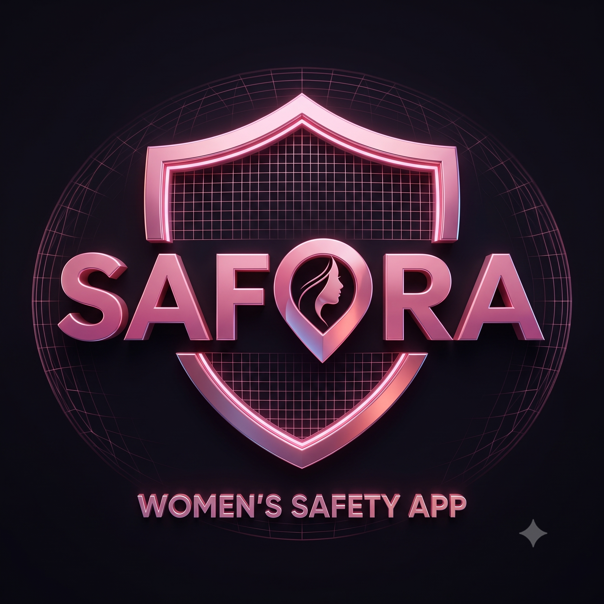

<div align="center">
  
  <h1>Angel AI — Personal Safety & Guardian Companion</h1>
  <p><strong>An enterprise-grade, proactive personal safety web and mobile application powered by AI de-escalation coaching, covert emergency triggers, and tamper-proof evidence archiving.</strong></p>

  <p>
    
    
    
    
    
    
  </p>
</div>

---

## 🌟 Executive Summary

**Angel AI** (formerly Seraphina) is a state-of-the-art personal safety companion designed to provide seamless protection, proactive journey monitoring, and instant crisis de-escalation. Built on an enterprise-grade **Universal Codebase Architecture**, Angel AI compiles natively to **Android**, **iOS**, and **Progressive Web App (PWA)** environments from a single React + TypeScript source tree.

Treating user safety as a paramount engineering challenge, Angel AI combines covert hardware gesture triggers, simulated phone calls, AI-driven de-escalation chat tactics, and AES-256 cloud-encrypted evidence vaults into an intuitive, visually stunning interface.

---

## 🏛️ Enterprise Universal Architecture

Angel AI is engineered following clean architecture principles and a strict **Platform Abstraction Layer (PAL)**. This allows the application to dynamically detect its runtime environment and utilize native device hardware when running on mobile, while gracefully falling back to HTML5 Web APIs when running in a browser.

```
angle-ai/
├── seraphina/                   # Main Application Workspace
│   ├── android/                 # Native Android Studio Project (Capacitor 7)
│   ├── ios/                     # Native Xcode iOS Project (Capacitor 7)
│   ├── public/                  # Static assets, PWA icons, logo, manifest
│   ├── src/
│   │   ├── assets/              # Branded images and logos
│   │   ├── components/          # Reusable UI & Layout components
│   │   │   ├── layout/          # AppShell, TopBar, Sidebar, BottomNav
│   │   │   └── ui/              # Design-system atomic components (Card, Chip, Button, SOS)
│   │   ├── core/                # Central business logic and state
│   │   │   ├── api/             # Typed API service layer & backend connectors
│   │   │   ├── hooks/           # Global AppState context & custom React hooks
│   │   │   └── types/           # Complete TypeScript domain models
│   │   ├── features/            # Feature-isolated screen modules
│   │   │   ├── auth/            # Authentication & biometric unlock
│   │   │   ├── dashboard/       # Home safety dashboard & quick status
│   │   │   ├── dummy-call/      # Realistic simulated incoming call overlay
│   │   │   ├── escape-coach/    # Real-time AI de-escalation chat coach
│   │   │   ├── guardian/        # AI Guardian Mode live journey tracking
│   │   │   ├── hidden-sos/      # Covert gesture triggers & decoy PIN mode
│   │   │   ├── onboarding/      # 3-step feature walkthrough
│   │   │   ├── profile/         # Guardian Circle management & settings
│   │   │   ├── safety-map/      # Interactive safe haven & emergency locator
│   │   │   ├── self-defence/    # Video micro-learning lesson library
│   │   │   ├── splash/          # Secure initialization splash screen
│   │   │   └── vault/           # Tamper-proof AES-256 evidence vault
│   │   ├── platform/            # Capacitor Native Abstraction Layer (PAL)
│   │   │   ├── hooks/           # useCapacitor, useHaptics, usePlatform
│   │   │   ├── services/        # Hardware wrapper implementations
│   │   │   └── types.ts         # Cross-platform device interfaces
│   │   ├── routes/              # Centralized React Router navigation
│   │   ├── App.tsx              # Root application provider wrapper
│   │   ├── index.css            # Custom Tailwind design tokens & utilities
│   │   └── main.tsx             # DOM entry point
│   ├── capacitor.config.ts      # Capacitor 7 enterprise native config
│   ├── index.html               # Web & PWA entry document
│   ├── package.json             # Project scripts and dependencies
│   ├── tailwind.config.js       # Custom curated safety theme palette
│   ├── tsconfig.json            # Strict TypeScript configuration
│   └── vite.config.ts           # Vite build optimizer & PWA Workbox setup
```

---

## 🛡️ Core Feature Modules

### 1. 🚶 AI Guardian Mode (`/guardian`)
* **Live Journey Tracking:** Continuous background GPS monitoring during solo commutes or night transit.
* **Check-In Countdown Timer:** Configurable safety intervals (e.g., 15 minutes). If the user fails to tap "I'm Safe", automated alerts and GPS coordinates are broadcast to their Guardian Circle.
* **Live Guardian Status:** Real-time visibility into which trusted contacts are currently online and monitoring the journey.

### 2. 🚨 Hidden SOS & Covert Triggers (`/hidden-sos`)
* **Covert Hardware Dispatch:** Trigger emergency alerts without looking at or unlocking the screen via 5x Power Button clicks or rapid device shaking.
* **Decoy PIN Protection:** If coerced by an attacker to unlock the phone, entering a special Decoy PIN opens Angel AI in a simulated "normal/inactive" state while silently broadcasting live GPS and recording background audio.
* **Silent Mode Operation:** Suppresses all visual flashing and speaker sounds during an active covert alert.

### 3. 📞 Realistic Dummy Call (`/dummy-call`)
* **Instant De-escalation:** Schedule a realistic simulated phone call to escape awkward, uncomfortable, or potentially dangerous social situations.
* **Customizable Caller ID:** Choose caller identities such as "Mom", "Boss", or "Roommate" with realistic phone numbers and avatars.
* **Interactive Voice Scripts:** When answered, the overlay plays pre-recorded realistic audio prompts (e.g., *"Hey! I need you to come outside right now, I'm waiting in the car!"*) to create a believable excuse to leave.

### 4. 🧠 AI Escape Coach (`/escape-coach`)
* **Real-time Tactical Guidance:** An intelligent conversational agent trained in crisis de-escalation, situational awareness, and emergency psychology.
* **Quick Action Chips:** One-tap contextual prompts (*"I'm being followed"*, *"Cab changed route"*, *"Harassment on metro"*) for rapid communication when typing is difficult.
* **Actionable Emergency Buttons:** Embedded chat cards allowing instant one-tap dialing to Police (112), live location sharing, or navigation to the nearest safe haven.

### 5. 🔒 Tamper-Proof Evidence Vault (`/evidence-vault`)
* **AES-256 Cloud Backup:** All photos, audio recordings, and GPS logs captured during alerts are instantly encrypted and mirrored to secure cloud servers.
* **Native Camera Capture:** Uses Capacitor Camera API on mobile devices to document harassment or threats with automatic timestamping and location tagging.
* **Chain of Custody:** Ensures recorded evidence cannot be deleted or tampered with locally if the device is seized or destroyed.

### 6. 🗺️ Interactive Safety Haven Map (`/safety-map`)
* **24/7 Safe Haven Locator:** Displays verified nearby safe locations including 24-hour cafes, police stations, hospitals, and well-lit public transit hubs.
* **Category Filtering:** Filter safe havens by type and view exact distances, operating hours, and verified safety ratings.
* **Live Navigation guidance:** One-tap routing to guide the user along the safest, best-lit pedestrian corridors.

### 7. 🥋 Self-Defence Micro-Learning (`/self-defence`)
* **Curated Video Library:** Quick 3-to-6 minute instructional modules teaching practical physical escape tactics and situational awareness.
* **Skill Levels:** Beginner, Intermediate, Essential, and Advanced courses covering wrist grab breaks, night transit safety, and verbal de-escalation.

### 8. 👤 Profile & Guardian Circle Management (`/profile`)
* **Trusted Contacts:** Add, edit, and manage primary and secondary emergency guardians.
* **Biometric Security:** Require native FaceID or Fingerprint authentication when launching the application.
* **Background Sync Controls:** Fine-tune background GPS tracking, auto-recording preferences, and system diagnostic monitoring.

---

## ⚡ Tech Stack & Native Integration

| Layer | Technology | Description |
| :--- | :--- | :--- |
| **Frontend Framework** | React 18 + TypeScript | Component-driven UI with strict type safety and hooks architecture. |
| **Build Tooling** | Vite 8.1 | Blazing fast HMR, optimized production bundling, and code splitting. |
| **Styling & Design** | Tailwind CSS 3.4 | Custom design token extension with curated HSL safety color palettes. |
| **Mobile Runtime** | Capacitor 7 | Enterprise native runtime bridging web code to iOS and Android hardware. |
| **Offline & PWA** | Vite PWA + Workbox | Offline service worker caching, manifest generation, and asset pre-fetching. |
| **Icons & Typography** | Google Fonts | *Plus Jakarta Sans* (Headers), *Inter* (Body), and *Material Symbols Outlined*. |

### Native Capacitor Plugins Configured:
* `@capacitor/camera` — Native photo and video evidence capture.
* `@capacitor/geolocation` — High-accuracy background and foreground GPS positioning.
* `@capacitor/haptics` — Tactile physical vibrations for covert SOS feedback and UI confirmations.
* `@capacitor/push-notifications` & `@capacitor/local-notifications` — Critical safety alerts and check-in reminders.
* `@capacitor/filesystem` — Secure local caching of encrypted audio/photo archives.
* `@capacitor/device` & `@capacitor/network` — Real-time telemetry and connectivity monitoring.

---

## 🚀 Getting Started & Setup Guide

### Prerequisites
* **Node.js:** v18.x or v20.x+
* **Package Manager:** `npm` (v9+)
* **Mobile Development (Optional):** Android Studio (for Android emulators/APKs) or Xcode (for iOS builds on macOS).

### 1. Clone & Install Dependencies
Open your terminal and navigate into the application project directory:
```bash
git clone https://github.com/mrigeshkoyande/Angle-AI.git
cd Angle-AI/seraphina
npm install
```

### 2. Run Local Development Server
To launch the responsive web application with live reload:
```bash
npm run dev
```
Open **http://localhost:5173/** (or port `5174` if `5173` is busy) in your browser.

### 3. Build for Production
To compile TypeScript and generate optimized production web bundles in `/dist`:
```bash
npm run build
```

---

## 📱 Mobile Application Setup (Android & iOS)

Angel AI is configured as an enterprise mobile app. Whenever you make changes to the React source code, sync them to the native platforms:

### 1. Sync Web Code to Native Projects
After running `npm run build`, copy the web assets and update Capacitor plugins:
```bash
npm run cap:sync
```

### 2. Run on Android Studio (Emulator or Physical Device)
To launch Android Studio with the Angel AI Android project automatically loaded:
```bash
npm run cap:open:android
```
* Once Android Studio opens, let Gradle finish indexing.
* Select an Android Virtual Device (AVD) from the top device dropdown (e.g., *Pixel 7 API 34*).
* Click the green **Run (▶️)** button to install and launch the APK!

### 3. Run on iOS (Xcode - macOS required)
```bash
npm run cap:open:ios
```

---

## 📜 Available NPM Scripts

| Script | Command | Purpose |
| :--- | :--- | :--- |
| `npm run dev` | `vite` | Starts local development server with Hot Module Replacement. |
| `npm run build` | `tsc -b && vite build` | Type-checks and builds production-ready PWA/Web bundle in `/dist`. |
| `npm run lint` | `oxlint` | Runs ultra-fast linter to check code quality and React best practices. |
| `npm run preview` | `vite preview` | Previews the production build locally. |
| `npm run cap:sync` | `cap sync` | Syncs web bundles and Capacitor plugin changes to Android & iOS folders. |
| `npm run cap:open:android`| `cap open android` | Opens the native Android project in Android Studio. |
| `npm run cap:open:ios` | `cap open ios` | Opens the native iOS project in Xcode. |

---

## 🎨 Design System & Custom Tokens

Angel AI utilizes a custom-tailored palette designed to evoke warmth, urgency, and premium reliability:
* **Primary / SOS Red (`#a33759`):** High-visibility action color used for emergency triggers, active guardian states, and primary CTA buttons.
* **Secondary / Warm Rose (`#8b4256`):** Supporting accent for secondary actions and check-in indicators.
* **Tertiary / Deep Slate (`#70535b`):** Neutral dark accent used for AI Escape Coach messages and system status chips.
* **Cream Background Gradient (`#fff8f7` to `#FFF7CD`):** A soft, comforting background gradient that reduces eye strain during stressful situations or night navigation.

---

## 🤝 Contributing

We welcome contributions to make Angel AI even safer and more robust!
1. Fork the Project
2. Create your Feature Branch (`git checkout -b feature/AmazingSafetyFeature`)
3. Commit your Changes (`git commit -m 'feat: add amazing safety feature'`)
4. Push to the Branch (`git push origin feature/AmazingSafetyFeature`)
5. Open a Pull Request

---

## 📄 License

This project is open-source and developed for personal safety and educational purposes. Distributed under the MIT License. See `LICENSE` for more information.

---

<div align="center">
  <p><strong>Built with ❤️ by Mrigesh Koyande & the Angel AI Engineering Team</strong></p>
  <p><a href="https://github.com/mrigeshkoyande/Angle-AI">https://github.com/mrigeshkoyande/Angle-AI</a></p>
</div>
